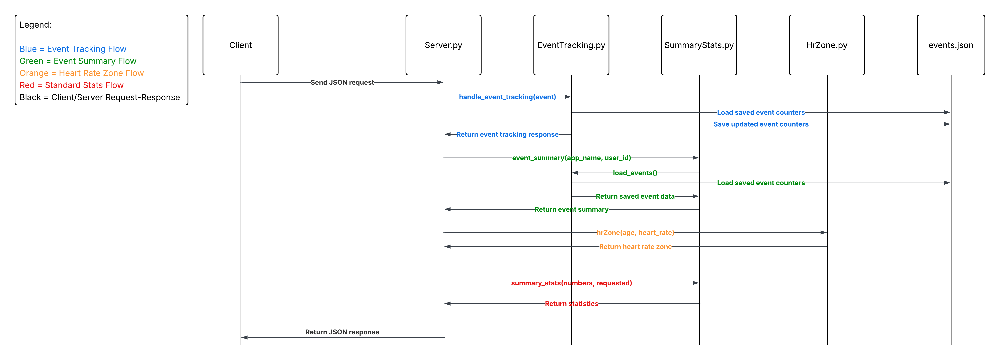

This is a statistics microservice, which means that it is a stand alone component which could be utilized by a variety of different programs for a statistical analysis. Because it functions independently of the requesting programs, microservices are by nature very modular--meaning that it could easily be integrated into a larger piece of software. The microservice works by receiving a request in JSON format. The request would contain a set of numbers and some information about what the microservice should do with the information. The microservice then sends the appropriate information back to the requesting program. 

1. The microservice receives sample data in a json format using ZeroMQ with a Req/Rep communication pattern and returns the requested statistics.

2. Connect to the microservice using:

    import zmq
    import json

    context = zmq.Context()
    socket = context.socket(zmq.REQ)

    socket.connect("tcp://localhost:5555")

3. Send and recieve information with:

    def send_request(socket, payload):
        socket.send_string(json.dumps(payload))
        reply = socket.recv_string()

        
 Send the information in the format:

    outgoing = {
        "numbers": [100, 2, 55, 89],
        "requested": ["min", "max", "average"]
    }
    send_request(socket, outgoing)

4. All available metrics will be returned if "requested" is omitted. Returned metrics can be specified (ex. "requested": ["min", "average"] will only return the minimum and average). More examples of usage are avilable in Sample.py. 

5. The microservice can also calculate the heart rate zone of a workout if provided with a user's age and average heart rate using:

    outgoing = {
        "age": 30,  
        "heart_rate": 130,
        "requested": ["heart_rate_zone"]
    }

 6. The user can also have the microservice track events and store data to then later get a summary from that stored data using:

    outgoing = {
        "event": {
            "app_name": "generic_app",
            "user_id": "user_123",
            "event_type": "button_click",
            "data_value": 3
        }
    }
    socket.send_string(json.dumps(outgoing))

    outgoing = {
        "app_name": "generic_app",
        "user_id": "user_123",
        "requested": ["event_summary"]
    }
    socket.send_string(json.dumps(outgoing))

7. UML Diagram
